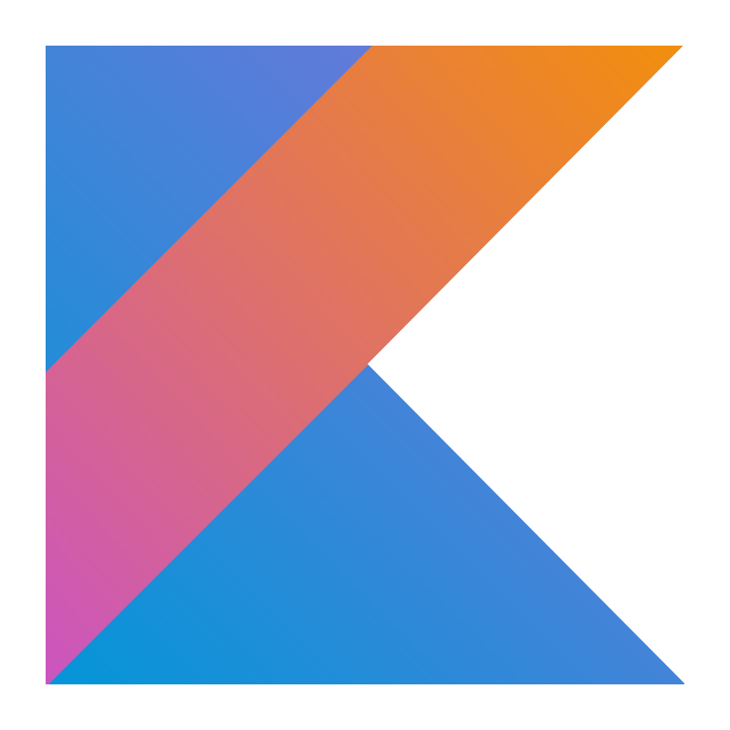
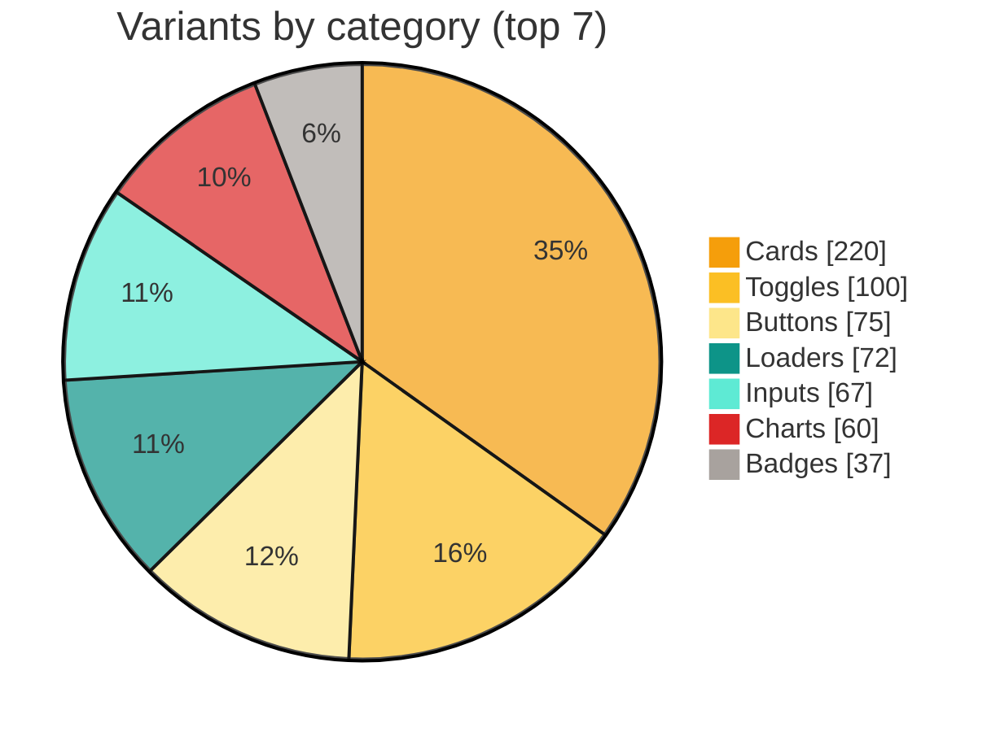
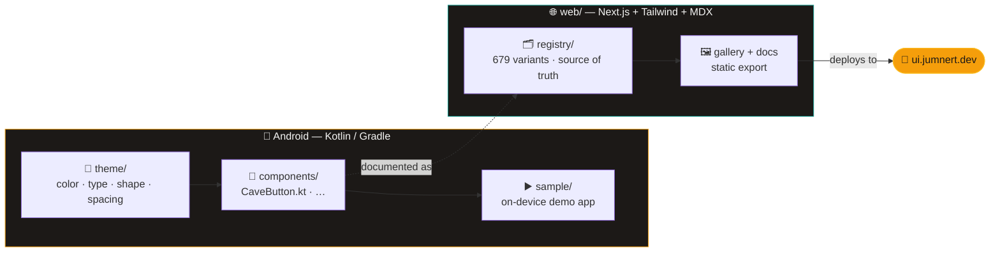
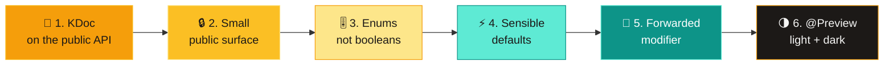

<!-- ╔══════════════════════════════════════════════════════════════════════╗ -->
<!-- ║                              caveui README                             ║ -->
<!-- ╚══════════════════════════════════════════════════════════════════════╝ -->

<div align="center">

<!-- Animated waving header -->


<!-- Animated typing tagline -->
<a href="https://ui.jumnert.dev">
  
</a>

<br/>

<!-- Badges -->
<p>
  <a href="LICENSE"></a>
  <a href="https://kotlinlang.org"></a>
  <a href="https://developer.android.com/jetpack/compose"></a>
  <a href="CONTRIBUTING.md"></a>
</p>

<p>
  <a href="https://ui.jumnert.dev"><b>🌐 Live Gallery</b></a>
  &nbsp;•&nbsp;
  <a href="https://ui.jumnert.dev/docs/introduction"><b>📖 Docs</b></a>
  &nbsp;•&nbsp;
  <a href="https://ui.jumnert.dev/components"><b>🧩 Components</b></a>
  &nbsp;•&nbsp;
  <a href="CONTRIBUTING.md"><b>🤝 Contribute</b></a>
</p>

<br/>

<!-- Tech stack (icons live in the repo) -->
&nbsp;&nbsp;
&nbsp;&nbsp;
&nbsp;&nbsp;
&nbsp;&nbsp;
&nbsp;&nbsp;
&nbsp;&nbsp;
&nbsp;&nbsp;


</div>

---

## 🪨 What is caveui?

**caveui** is a growing, community-driven catalog of polished **Jetpack Compose** components — buttons, cards, inputs, loaders, charts and more. Inspired by [shadcn/ui](https://ui.shadcn.com), [uiverse](https://uiverse.io) and Tailwind UI, but for **Android**.

```
🧩  Copy-paste, not a dependency   — read it, copy it, own it. No black boxes.
🎨  Built on Material 3            — free dark mode, dynamic color & accessibility.
📦  Self-contained                 — one component, one folder.
🌐  Documented on the web          — live gallery with copy-paste code, no backend.
```

<div align="center">

| 🧩 Components | 🗂️ Categories | 🧱 Blocks | 🌗 Themes | 📜 License |
|:---:|:---:|:---:|:---:|:---:|
| **679+** | **21** | **32** | Light + Dark | MIT |

</div>

---

## 📊 Component catalog at a glance

> Live, copy-paste variants per category — the catalog grows with every contribution.



<details>
<summary><b>📋 Full breakdown — all 21 categories</b></summary>

<br/>

| Category | Variants | Distribution |
|:--|:--:|:--|
| 🃏 Cards | 220 | `████████████████████` |
| 🎚️ Toggles | 100 | `█████████` |
| 🖱️ Buttons | 75 | `███████` |
| ⏳ Loaders | 72 | `██████` |
| ⌨️ Inputs | 67 | `██████` |
| 📈 Charts | 60 | `█████` |
| 🏷️ Badges | 37 | `███` |
| 💬 Feedback | 5 | `▌` |
| 🎛️ Sliders | 4 | `▍` |
| 📅 Pickers | 4 | `▍` |
| 🗂️ Overlays | 4 | `▍` |
| 🧭 Navigation | 4 | `▍` |
| 📜 Menus | 4 | `▍` |
| ⌘ Command | 4 | `▍` |
| 👤 Avatars | 4 | `▍` |
| 🔽 Selects | 3 | `▎` |
| 📂 Disclosures | 3 | `▎` |
| 🔘 Choices | 3 | `▎` |
| ☑️ Checks | 3 | `▎` |
| 💡 Hints | 2 | `▏` |
| ✨ Icons | 1 | `▏` |
| **Total** | **679** | |

</details>

---

## 🏗️ How the monorepo fits together

A single repo with two worlds: the **Android library** (Kotlin/Gradle) and the **docs website** (Next.js).



```
caveui/
├── library/        # 📦 The published Compose library — components live here
│   └── src/main/java/io/caveui/
│       ├── theme/          # Design tokens: color, typography, shapes, spacing
│       └── components/     # One folder per component (button, …)
├── sample/         # ▶️ Android demo app — the test bed for every component
├── web/            # 🌐 Next.js + Tailwind + MDX static gallery (no backend)
├── CONTRIBUTING.md # 🤝 How to add a component (start here to help!)
└── README.md
```

---

## 🚀 Quick start

### Use a component

> Every component is copy-paste Compose, built on Material 3. Wrap your app in `CaveTheme` and go.

```kotlin
import io.caveui.components.button.CaveButton
import io.caveui.theme.CaveTheme

CaveTheme {
    CaveButton(
        text = "Get started",
        onClick = { /* ... */ },
        variant = CaveButtonVariant.Primary,
    )
}
```

### Run the demo app

```bash
git clone https://github.com/Jumnert/CaveUI.git
./gradlew :library:assembleDebug :sample:assembleDebug
# then open the `sample` module in Android Studio and hit ▶️
```

### Run the docs site

```bash
cd web
npm install
npm run dev      # → http://localhost:3000
npm run build    # static export to web/out/  (no backend)
```

<div align="center">

**Prerequisites** — JDK 17 · Android SDK (compileSdk 35, minSdk 24) · Node 20+ for the docs site

</div>

---

## 🎨 Theming

caveui is built on Material 3 with a thin design-token layer. Components never hard-code colors or sizes — they read from the theme, so light, dark and dynamic color all work for free.

<div align="center">

| Role | Light | Dark |
|:--|:--|:--|
| 🟠 **Primary** — `Amber` | `#F59E0B` | `#FBBF24` |
| 🟢 **Secondary** — `Teal` | `#0D9488` | `#5EEAD4` |
| 🔴 **Error** — `Red` | `#DC2626` | `#FCA5A5` |
| ⬜ **Surface** — `Stone` | `#FFFFFF` | `#292524` |

</div>

```kotlin
Surface(
    color = MaterialTheme.colorScheme.surface,
    shape = MaterialTheme.shapes.large,
) {
    Text(
        text = "Themed",
        style = MaterialTheme.typography.titleMedium,
        modifier = Modifier.padding(CaveTheme.spacing.md),
    )
}
```

---

## 🤝 Contributing

caveui is **community-driven** — adding a component is a single, well-defined pull request. [`CaveButton.kt`](library/src/main/java/io/caveui/components/button/CaveButton.kt) is the reference template; copy its shape. Every component follows the same six rules:



The flow: **scaffold the component → add a section to the `sample` app → verify `./gradlew assembleDebug` → add a docs page → verify `npm run build` → open a PR with a screenshot/GIF.** Full recipe in [CONTRIBUTING.md](CONTRIBUTING.md).

---

## 🌍 Deploy the docs site

The site is a fully static export (`output: "export"`) — no server, no backend.

| Host | Setup |
|:--|:--|
|  **GitHub Pages** | Push to `main`; the workflow builds `web/` and deploys `web/out/`. |
| 🟦 **Netlify** | `netlify.toml` is preconfigured (base `web`, publish `out`). Zero setup. |
| ▲ **Vercel** | `vercel.json` is preconfigured — root `web/`, output `web/out/`. |

---

<div align="center">

## 📜 License

[**MIT**](LICENSE) © caveui contributors — copy the code, customize it, ship it.

<br/>

<a href="https://ui.jumnert.dev"></a>

<br/><br/>


<sub>Built with 🪨 by the community · Inspired by shadcn/ui, uiverse & Tailwind UI</sub>

</div>
